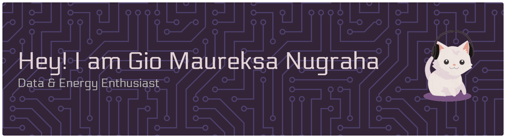

<h1 align="left">Hi there, I'm Gio Maureksa Nugraha 👋</h1>

<!--
**giomaureksa/giomaureksa** is a ✨ _special_ ✨ repository because its `README.md` (this file) appears on your GitHub profile.

Here are some ideas to get you started:

- 🔭 I’m currently working on ...
- 🌱 I’m currently learning ...
- 👯 I’m looking to collaborate on ...
- 🤔 I’m looking for help with ...
- 💬 Ask me about ...
- 📫 How to reach me: ...
- 😄 Pronouns: ...
- ⚡ Fun fact: ...
-->

🎓 Engineering Physics Student at Universitas Gadjah Mada  
⚡ Interested in Instrumentation, Control Systems, Programming & AI  
📊 Aspiring Data Scientist | AI/ML Enthusiast | Tech-Driven Problem Solver

## About Me

I'm an Engineering Physics student passionate about solving real-world problems through technology, data, and intelligent systems.  

My academic focus lies in:
- Instrumentation Systems
- Control Engineering
- Computational Modeling
- Data Analysis & Machine Learning

Currently, I'm building my AI/ML roadmap and transitioning toward Data Science, while leveraging my strong engineering foundation in mathematics, physics, and systems thinking.

I believe in structured thinking, analytical depth, and continuous learning.

## What I'm Currently Working On

- 📚 Deepening my understanding of Machine Learning & Data Science
- 🧪 Building small applied AI projects
- 🌐 Developing technical and analytical portfolio projects
- 📈 Preparing for freelance opportunities in data entry & data mining
- 🛠 Strengthening Python and data ecosystem skills

## Skills

## Let's Connect!
  

I'm open to collaboration, research discussions, engineering projects, and AI-related opportunities.

